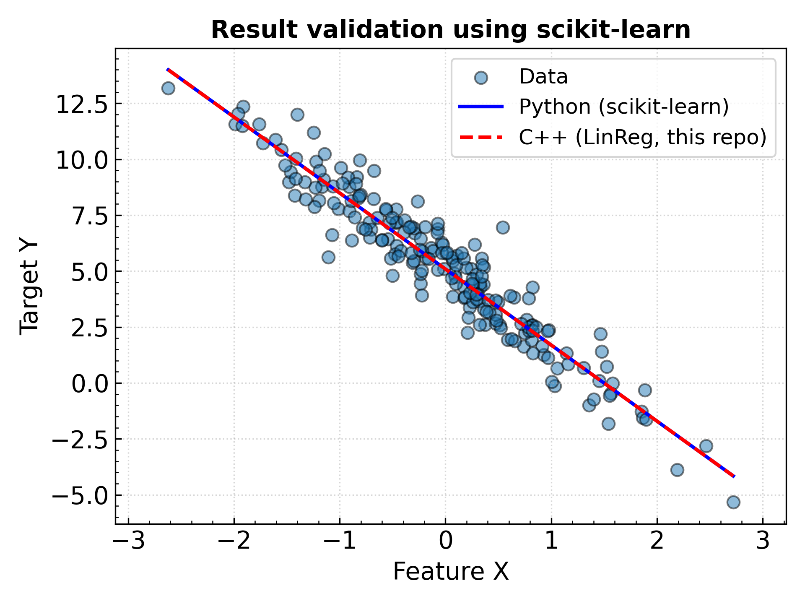

# LinReg: Minimal Linear Algebra in C++ with Linear Regression

This project is a self-contained C++ implementation of a **minimal linear algebra library**, and a **linear regression engine**.
The goal is to demonstrate how to implement the simplest linear regression from scratch, including the matrix operations such as multiplication, transpose, and inverse (via Gauss-Jordan elimination).

The results are validated in the below Figure and compared against the `scikit-learn` implementation in Python.


## Approach

This repo uses the closed-form solution to linear regression, computed as $~~~\beta = (X^T X)^{-1} X^T Y~~~$ where:

$Y$: ($[n \times 1]$) target values   
$X$: ($[n \times p]$) input matrix   
$\beta$: ($[p \times 1]$) learned coefficients (including the bias term, automatically added)   

and:

$n$: number of samples or observations   
$p$: number of features   

## Build

C++11 or later required.
```
make
```

## Design

### Classes:

- `BaseMatrix`: Abstract base class for matrix-like classes.
- `DenseMatrix`: inherits from `BaseMatrix` and stores dense 2D data using `std::vector`.
- Inheritance is used to allow for extensible designs like `SparseMatrix` in the future.
- Smart pointers are used (C++11 or later) to ensure memory safety.

### Methods:
- Single-matrix operations, such as transpose or inverse, are methods of the `DenseMatrix` objects.
- Two-matrix operations, such as multiplications or linear-regression are implemented in `MatrixOperations` class.
- The `linearRegression` method adds the bias term automatically for intercept values and returns the $\beta$ values.
